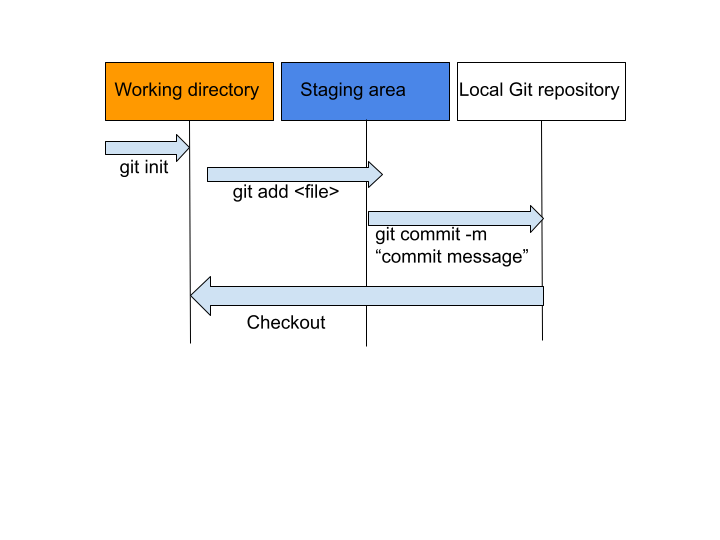

# Control Flow

## What is Version Control?

Version control is the practice of tracking and managing changes to software code. There are different ways to implement
this practise such as delta based version control and snapshots. In delta based version control you store information as
a list of file-based changes. Such systems include CVS, Subversion and Perforce.

Version control is important because it helps software teams manage changes to source code over time. It is
especially useful for DevOps teams since it reduces development time and increase successful deployments. If a mistake 
is made, developers can use version control to go back to a previous state to help fix the mistake while minimizing 
disruption to all team members. It also supports branching where team members can work on different branches that work 
independently from each other while also allowing merging that work back together to avoid conflicts.

## What is Git?

Git is a distributed version control system that uses snapshots. Snapshots are the state all your files at that moment. Git takes a 
snapshot every time you commit (save) the state of your project and stores a reference of it. If a file has not changed,
Git does not store the file again, just a link to the previous identical file. Git stores a local copy of these snapshots,
accessed using Git Bash, as well as an option to store a remote copy in a Git server such as GitHub. 

## Git Workflow

1. A repository, or repo, is a directory tracked by git. We can make git track a directory by calling `git init`. This creates a
`.git` hidden directory in the directory we called it which is where git stores the state of the repository.
2. We can call `git status` to see what branch we are on, a list of commits and a list of untracked files. 

3. We can begin tracking files using `git add <file>...` or simply `git add .` to track all files in the repo. This updates the
staging area which is a file, generally contained in your git directory, that stores information about what files will go into
the repo. 
4. To take a snapshot, we can call `git commit -m "commit message"` which takes the files as they are in the staging area
and stores that snapshot permanently to your Git directory

