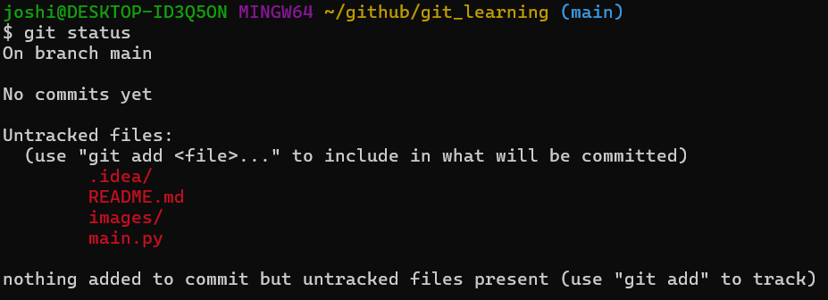

# Version Control

## What is Version Control?

Version control is the practice of tracking and managing changes to software code. There are different ways to implement
this practise such as delta based version control and snapshots. In delta based version control you store information as
a list of file-based changes. Such systems include CVS, Subversion and Perforce.

Version control is important because it helps software teams manage changes to source code over time. It is
especially useful for DevOps teams since it reduces development time and increase successful deployments. If a mistake 
is made, developers can use version control to go back to a previous state to help fix the mistake while minimizing 
disruption to all team members. It also supports branching where team members can work on different branches that work 
independently from each other while also allowing merging that work back together to avoid conflicts.

## What is Git?

Git is a distributed version control system that uses snapshots. Snapshots are the state all your files at that moment. Git takes a 
snapshot every time you commit (save) the state of your project and stores a reference of it. If a file has not changed,
Git does not store the file again, just a link to the previous identical file. Git stores a local copy of these snapshots,
accessed using Git Bash, as well as an option to store a remote copy in a Git server such as GitHub. 

## Git Workflow

1. A repository, or repo, is a directory tracked by git. We can make git track a directory by calling `git init`. This creates a
`.git` hidden directory in the directory we called it which is where git stores the state of the repository.
2. We can call `git status` to see what branch we are on, a list of commits and a list of untracked files. 

3. We can begin tracking files using `git add <file>...` or simply `git add .` to track all files in the repo. This updates the
staging area which is a file, generally contained in your git directory, that stores information about what files will go into
the repo. 
4. To take a snapshot, we can call `git commit -m "commit message"` which takes the files as they are in the staging area
and stores that snapshot permanently to your local git repo. We can call `git ls-files` to see all files tracked by git,
and `git log` to see a history of commits made and by who. 
5. `git diff` displays the difference in file content between files in the staging are and files in the local git repo. 

### .gitignore

We may not want certain files to be tracked for multiple reasons (security, convenience) and so we can use a `.gitignore`
file to tell git which files to ignore. You simply write the name of the file(s) you want git to ignore in the file
and git will treat these files as if they were not in the repo. 

## Distributed version control

The previous workflow is an example of a centralized workflow, where multiple nodes, or computers, connect to the same repository
and to access the data you must be connected to the same network. Git also supports distributed workflows, where we not only
store a local copy of the data but also a remote copy in a git server. We can access the remote copy by connecting to the server
and this creates a link between the remote copy and your local repo.

Distributed version control is ideal since we can access our data from anywhere we have an internet connection and can also back it up. 
This also means developers may make overlapping changes or update the repo simultaneously and this provides a system to
handle these conflicts by working on your personal local repos before sending their work back to the remote server.

### GitHub

GitHub is an example of a git server that we can use to create, store, manage and share code. You can simply upload files
via the website, as well as connect your local repos via HTTPS or SSH or even using the GitHub Desktop GUI. Some other
examples of git servers include GitLab and BitBucket.

## Distributed workflow - Local to remote

1. Create a new repository on GitHub
2. Ensure you have completed the previous workflow to have a local git repo
3. Link the remote repo to your local repo with `git remote add origin <link to repo>`. You can connect with HTTPS or SSH,
and you may have to authenticate with a personal access token or SSH key.
4. Create a main branch with `git branch -M main` that contains your work.
5. Push the branch to the remote repo with `git push -u origin main`.

