# Use SSH keys for GitHub authentication

## Motivation

We do not just want our repositories to be public and allow read/write access to anyone. As a result, we can use SSH authentication to ensure only authenticated members are allowed read/write access.

SSH works by using keys, and uses public/private key pairings. The public key is, as the name suggests, public and can be thought of as your front door lock. Everyone can see this, and we are fine with that. What we do not want is anyone to have access to our front door key. Therefore, the private key can be seen as our actual 'key'.

We can use `ssh-keygen` to create a key pairing


The following README will discuss how to use our public and private keys in order to secure a GitHub repository.

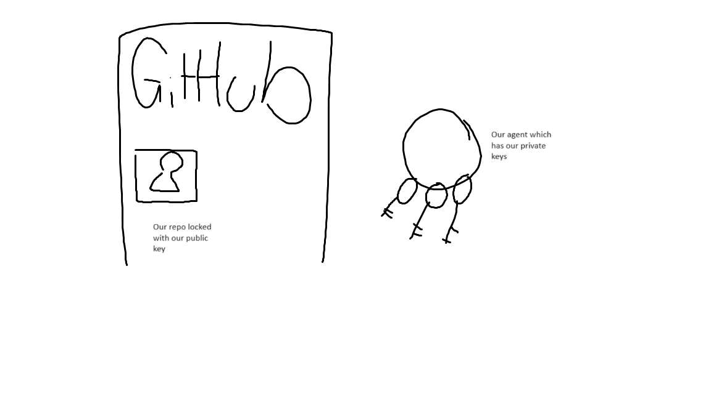


## 1. Create your GitHub repo and a local directory

Navigate to [GitHub](github.com), sign in and create a repository or have one ready. At the same time, create a local directory that we want to store the contents in

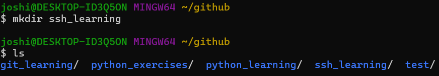

## 2. Create your SSH key

Use `ssh-keygen` to generate a public/private key pairing that you will use for authentication. The usual command is:
```commandline
ssh-keygen -t rsa -b 4096 -C "<your_email>"
```
where:
- `-t` lets you choose the encryption algorithm (RSA is a standard)
- `-b` selects the number of bytes (4096)
- `-C` is a comment (for verification)

Once called, the public/private rsa key pair will be generated. The terminal will prompt for a name, you can choose anything you would like.

The terminal will also ask for an optional passphrase, you can enter one but it is not necessary for this example. If you do, you must remember it as you will have to enter it again later.

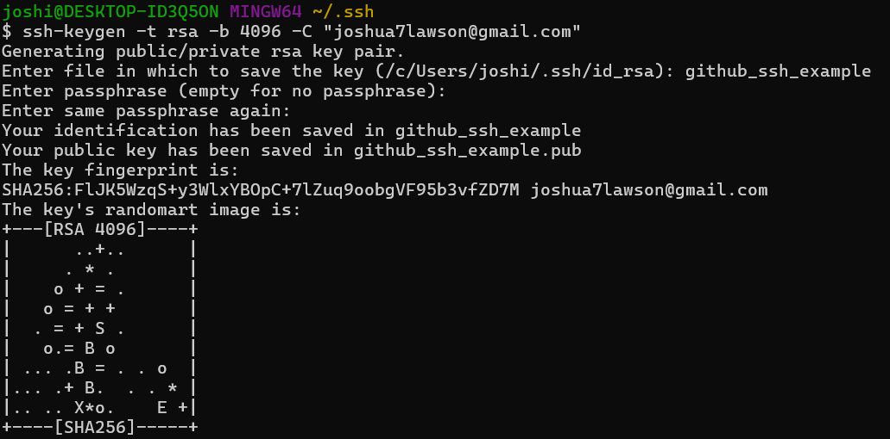

Once the command has finished executing, the public/private key pairing will be created. It is located in the hidden `.ssh/` directory in your home directory. You can quickly access this by running `cd` followed by `cd .ssh/`:
```commandline
cd
cd .ssh/
```

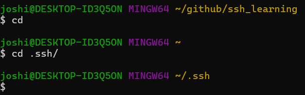

## 3. Copy your public key and add it to your GitHub repository

In our `.ssh` directory you should now have 2 files: a file with no extension and a file with a `.pub` extension. The name of the files is the same name you gave to the terminal in 2. The public key has the `.pub` extension and the private key is the other one

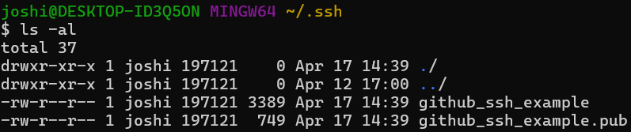

What you need to do now is send our public key to our GitHub repo, so that you can use our private key to authenticate yourself. You can print the contents of the file with the `.pub` extension to the terminal with the `cat` command:
```commandline
cat github_ssh_example.pub
```

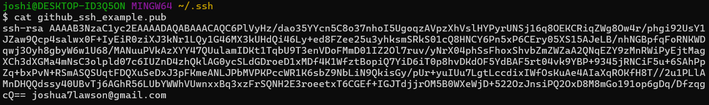

This long string that ends with the comment you provided to `ssh-keygen` is your public key. You need to add it to our GitHub repository, so copy it over and navigate to your repositories settings:

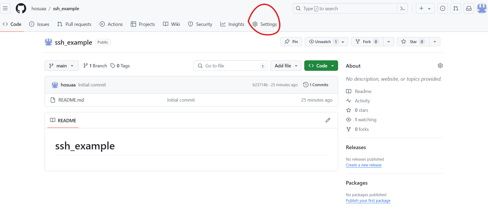

Then head to Deploy Keys and press Add Deploy Key

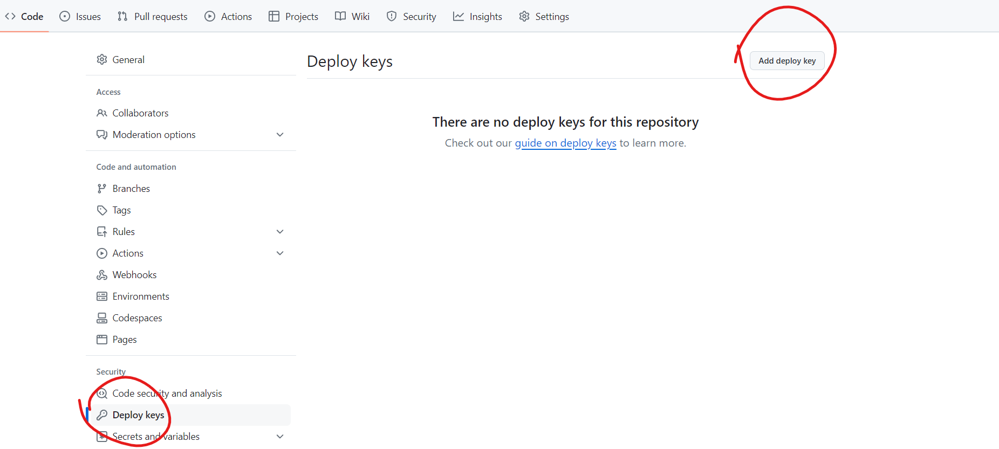

Finally paste in the key you copied, ensure allow write access is turned on (to allow you to `git push` to the repository later) then press Add Key

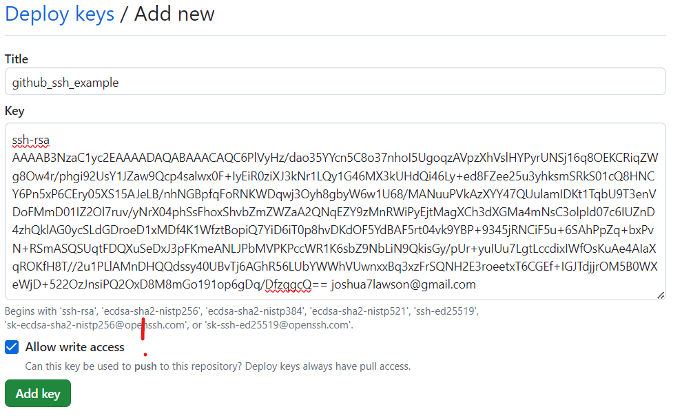

Now our repository is secure, and only those with access to the corresponding private key can read from or write to this repository. 

## 4. Authenticate yourself with your private key

Now you need to authenticate yourself in order to do anything useful with this repository (`git clone, git push`...)

To do this, you can run an ssh agent and add our key to it so that whenever you try to access the repository, the agent will authenticate you.

To run an ssh agent we execute:
```commandline
eval `ssh-agent`
```
This spawns a small shell process which is constantly running in the background. Whenever you need to authenticate through SSH, first it will look at your agent and see if you have the correct private key.

You can add your private key to the agent by running:
```commandline
ssh-add ~/.ssh/github-test-key
```

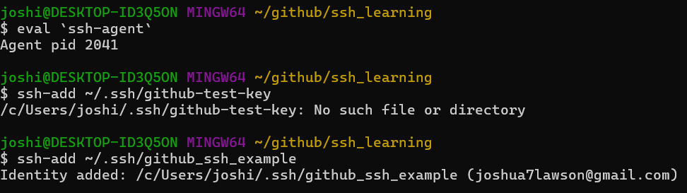

The agent can be thought of as a keyring, and by calling `ssh-add` you are effectively adding that key to the keyring. Multiple keys can be added to the agent.

However, since the agent is a shell process, which runs in your terminal, whenever you close the terminal the agent also shuts down, so these commands must be run every time you open a new terminal and need to authenticate yourself. 

## 5. Test your connection

Now you should be ready to start using SSH in combination with GitHub!

To test your connection, run `ssh -T git@github.com`. If all is well, your terminal should output something like this:

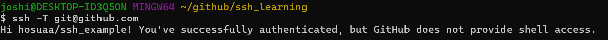

Now we can finally use our repository. Get your repository link from your GitHub repo:

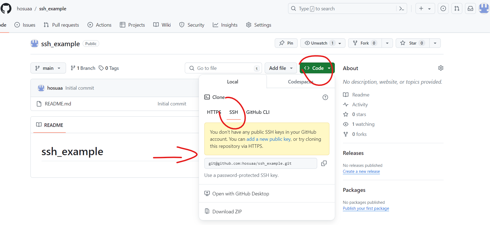

In your local directory you created, run:
```commandline
git clone <your repository link>
```

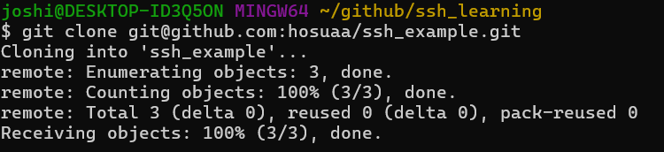

And the command should run. Since it ran you have read/write access and so you have authenticated yourself with SSH.